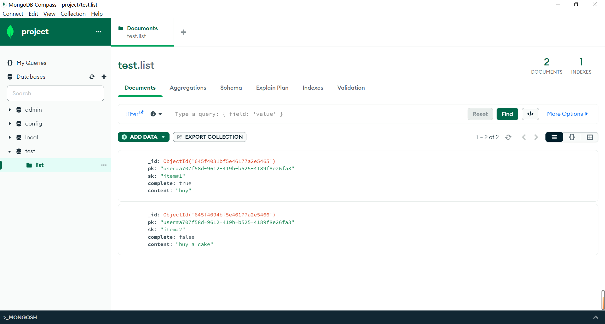

[](https://classroom.github.com/a/Ha6DivV4)

CSIT6000o Project - Serverless To Do List Application

| Name      | SID      | ITSC    | CONTRIBUTION                                                 |
| --------- | -------- | ------- | ------------------------------------------------------------ |
| PAN Han   | 20881280 | hpanan  | Openfaas functions, MongoDB, Kubernetes deployment, Automation scripts |
| CHEN Chen | 20881450 | cchencu | Modify,build and deploy frontend service, Replace API Gateway with NGINX Ingress Controller, Automation scripts |
|           |          |         |                                                              |

## Background

This project derives from the serverless web application from AWS Sample: https://github.com/aws-samples/lambda-refarch-webapp. We use OpenFaas to replace AWS Lambda functions, MongoDB to replace AWS DynamoDB and Nginx to replace AWS API Gateway.

## Infrastructure

The project is ready for deployment to a kubernetes cluster. To make the deployment simple enough, we build some automation script to deploy the project to a single-node Minikube cluster built on an AWS EC2 machine. The EC2 instance should expose the HTTP port 80 for frontend web application and port 8080 for OpenFaas functions. The deployments include a MongoDB database, several OpenFaas functions and a React Frontend application. All of these are deployed to the same namespace in the Kubernetes cluster: openfaas-fn. The infrastructure is illustrated by the figure below:

此处应有图。

## Deploy to an AWS EC2 instance

For the test machine, we choose the following config:

|               |                                        |
| ------------- | -------------------------------------- |
| OS            | Ubuntu Server 22.04 TLS                |
| Architecture  | 64-bit(x86)                            |
| Instance Type | M5.large                               |
| Network       | Public Subnet with public IP           |
| SG            | TCP Ports: 22, 80, 8080 From: Anywhere |
| Storage       | 30GiB gp3 on Root volume               |

> **After the deployment, all the Openfaas functions can be accessed through {server_ip}:31112/ui/. The mongodb database can be accessed through {server_ip}:27017 with compass.And the Frontend Web App can be accessed through http://{server_ip}**

## Automatic Deployment

### Setup

To setup the environment, you can use an automatic script on EC2 launch.

```bash
#!/bin/bash
git clone https://github.com/hkust-6000o-2023s/course-project-cloud-explorers
# navigate to the code repo
cd course-project-cloud-explorers
# setup
sh setup.sh 2>&1 | tee /tmp/setup.log
# set environment variables 
# remember to replace with the public network ip of your EC2 instance
sudo SERVER_IP={public network ip} sh deploy.sh 2>&1 | tee /tmp/deploy.log
```

The user data runs two scripts:

- setup.sh: install minikube, kubectl, docker, socat, conntrack, arkade, faas-cli
- deploy.sh: deploy openfass, custom openfaas functions, mongodb, nginx ingress controller and frontend application

The deploy script also exposes mongodb database through ```kubectl port-forward```.

## Manual Deployment

### Setup

To setup the environment, some packages need to be installed.

| Package   | Description                                                  |
| --------- | ------------------------------------------------------------ |
| minikube  | Single-node local k8s cluster                                |
| kubectl   | CLI to control k8s cluster                                   |
| docker    | All the components of the project is deployed as Docker images |
| socat     | Support port forwarding to expose service of k8s cluster     |
| conntrack | Support starting Minikube with none driver                   |
| arkade    | Marketplace for Openfaas in k8s                              |
| faas-cli  | CLI to build/delpoy openfaas functions                       |

Installation Commands:

> **_NOTE:_** These commands are only tested on Ubuntu 22.04 TLS platform

Minikube:

```bash
curl -LO https://storage.googleapis.com/minikube/releases/latest/minikube-linux-amd64
sudo install minikube-linux-amd64 /usr/local/bin/minikube
```

Kubectl:

```bash
curl -LO "https://dl.k8s.io/release/$(curl -L -s https://dl.k8s.io/release/stable.txt)/bin/linux/amd64/kubectl"
sudo install -o root -g root -m 0755 kubectl /usr/local/bin/kubectl
```

Docker:

```bash
sudo apt-get update && sudo apt-get install docker.io -y
```

Socat:

```bash
sudo apt-get install socat -y
```

Conntrack:

```bash
sudo apt-get install -y conntrack
```

Arkade:

```bash
curl -sLS https://get.arkade.dev | sudo sh
```

Faas-cli:

```bash
curl -sL https://cli.openfaas.com | sudo sh
```

### Deploy

> **_NOTE:_** **This part needs to be run as the root user**
>
> `sudo -i`

#### Step 1: Start Minikube

```bash
minikube start --kubernetes-version=v1.22.0 HTTP_PROXY=https://minikube.sigs.k8s.io/docs/reference/networking/proxy/ --extra-config=apiserver.service-node-port-range=6000-32767 disk=20000MB --vm=true --driver=none
```

Sometimes minikube fails to start. `minikube delete` can helps.

Enable the NGINX Ingress controller in a Minikube cluster.

```bash
minikube addons enable ingress
```

Verify that the NGINX Ingress controller is running(should wait for a while).

```bash
kubectl get pods -n ingress-nginx
```

#### Step 2: Deploy Openfaas Functions

This simple command will install openfaas but it will generate random password.

```bash
arkade install openfaas --set=faasIdler.dryRun=false 
```

Ensure the gateway service is ready before running the next command. 

```bash
kubectl rollout status -n openfaas deploy/gateway
```

Forward traffic from port 8080 of the local machine to port 8080 of the `gateway` service, allowing you to access the service locally. And always run this command in the background to keep it from occupying the terminal.

```bash
kubectl port-forward -n openfaas svc/gateway 8080:8080 &
```

Gain the random generated password and login in faas-cli

```bash
PASSWORD=$(kubectl get secret -n openfaas basic-auth -o jsonpath="{.data.basic-auth-password}" | base64 --decode; echo)
echo -n $PASSWORD | faas-cli login --username admin --password-stdin
```

```bash
cd ${REPO_HOME}/faas
```

OpenFaaS does not have a default python template, so pull the template it first. Then, compile the yml, push it to docker, and then pull down from docker to deploy.

```bash
faas-cli template store pull python3-http
faas-cli build -f stack.yml
faas-cli push -f stack.yml
faas-cli deploy -f stack.yml
```

Then you can access http://{server_ip}:31112 to test the backend service.

If you get an error, you can use this command to see the log.

```bash
faas-cli logs {function_name} --gateway http://{server_ip}:31112
```

#### Step 3: Deploy Mongodb

```bash
#navigate to the code repository
cd ${REPO_HOME}
```

An mongodb-service is created in openfaas-fn namespace.

```bash
kubectl apply -f mongodb.yml
```

**Visualize MongoDB**

If you want to visualize the MongoDB, you can install [MongoDB Compass](https://www.mongodb.com/products/compass). This is not necessary.

Port-forward for MongoDB to port 27017.

```bash
kubectl port-forward -n openfaas-fn svc/mongodb-service 27017:27017 --address=0.0.0.0 &
```

 A port forwarding is necessary so that the MongoDB Compass can access through http://{server_ip}:27017. Ensure the mongodb-service is ready before running this command. And always run this command in the background to keep it from occupying the terminal.

Here is the string to connect to the MongoDB.

```bash
mongodb://admin:admin@{server_ip}:27017/?authMechanism=DEFAULT
```

After connection, you can see



#### Step 4: Deploy Frontend

```bash
#enter the code repository
cd ${REPO_HOME}
```

This command creates a Deployment resource as described in the `frontend-deployment.yml` file. This Deployment is used to manage a set of replicas of a Pod, which runs your application.

```bash
kubectl apply -f frontend-deployment.yml
```

This command creates  a Service resource as described in the `frontend-service.yml` file. The Service provides network access to one or more sets of Pods, in this case likely the Pods managed by the Deployment created in the previous command.

```bash
kubectl apply -f frontend-service.yml
```

#### Step 5: Deploy NGINX Ingress Controller 

```bash
kubectl apply -f ingress.yml
```

## Build Docker Image

#### Preperation

Install Docker

```bash
sudo apt-get update && sudo apt-get install docker.io -y
```

Login Docker

```bash
sudo docker login
```

#### How to Dokernize MongoDB 

Pull the mongo image from official image.

```bash
docker pull mongo:4.0.4
```

Build a container

```bash
docker run -it --name faas-mongodb \
-e MONGO_INITDB_ROOT_USERNAME=admin \
-e  MONGO_INITDB_ROOT_PASSWORD=admin \
-p 10001:27017 -d mongo:4.0.4
```

Get into container

```bash
docker exec -it faas-mongodb mongo
```

Then you can make adjustments to the MongoDB database

```bash
docker commit faas-mongodb imagesId
```

Tag

```bash
docker tag imagesId {dockerHub repository url}:tagname
```

Push it to the docker

```bash
docker push {dockerHub repository url}:tagname
```

#### How to Dockerize the React Application

Navigate to the directory where the Dockerfile is located

```bash
cd ${REPO_HOME}/www
```

Build docker image

```bash
# when you build your image, remember to replace cccccci with your dockerhub username
sudo docker build -t cccccci/todolist-frontend .
```

Run docker image (optional)

```bash
sudo docker run -d -p 80:8888 cccccci/todolist-frontend
```

Push docker image 

```bash
# also remember to use your own username
sudo docker push cccccci/todolist-frontend
```

## Reference

MongoDB：

https://tsejx.github.io/devops-guidebook/deploy/docker/mongodb/

https://www.cnblogs.com/soowin/p/14209581.html

https://blog.csdn.net/majiayu000/article/details/126491116

https://blog.csdn.net/qq_28550263/article/details/119892582

https://www.panyanbin.com/article/c602b9e2.html

https://juejin.cn/post/6844903597465927694

https://blog.alexellis.io/serverless-databases-with-openfaas-and-mongo/


OpenFass：

https://mfarache.github.io/mfarache/Url-Shortener-with-openfaas/

https://www.jianshu.com/p/6575a29840fd

https://blog.csdn.net/qq_30038111/article/details/113902683

https://blog.51cto.com/u_15064632/4317062

https://blog.csdn.net/qq_30038111/article/details/113902683

https://zhuanlan.zhihu.com/p/601314424

https://segmentfault.com/a/1190000023702396

Kubernetes：

https://kubernetes.io/docs/tasks/access-application-cluster/ingress-minikube/

https://kubernetes.github.io/ingress-nginx/how-it-works/

https://devopscube.com/kubernetes-ingress-tutorial/

https://kubernetes.io/docs/concepts/services-networking/

https://blog.csdn.net/weixin_42595012/article/details/100692084

https://blog.csdn.net/sinat_32582203/article/details/120449471

React：

https://blog.logrocket.com/deploy-react-app-kubernetes-using-docker/

https://mattermost.com/blog/how-to-deploy-a-react-app-to-kubernetes-using-docker/
